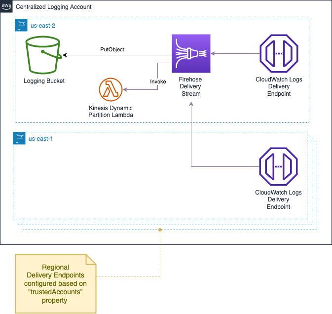

# aws-cdk-centralize-logs-typescript

This is a CDK project that set up centralized logging to an S3 bucket via a Kinesis Firehose.
The solution allows you to specify trusted accounts for different regions or principalOrgIds and regions  and then will configure the CloudWatch Log Delivery Endpoint with proper permissions in those regions

Solution is based heavily on [Centralize Cloudwatch Log with CDK](https://github.com/aws-samples/aws-centralize-logs-using-cdk)
## Architecture

## Useful commands

* `npm run build`   compile typescript to js
* `cdk deploy -c account=<your_account> -c region=<your_region> -c trustedAccounts=<accountId>:<region>,<accountId>:<region>,...`
 or 
* `cdk deploy -c account=<your_account> -c region=<your_region> -c principalOrgIds=<orgId>,<orgId>,... -c regions=<region>,<region>,..`

